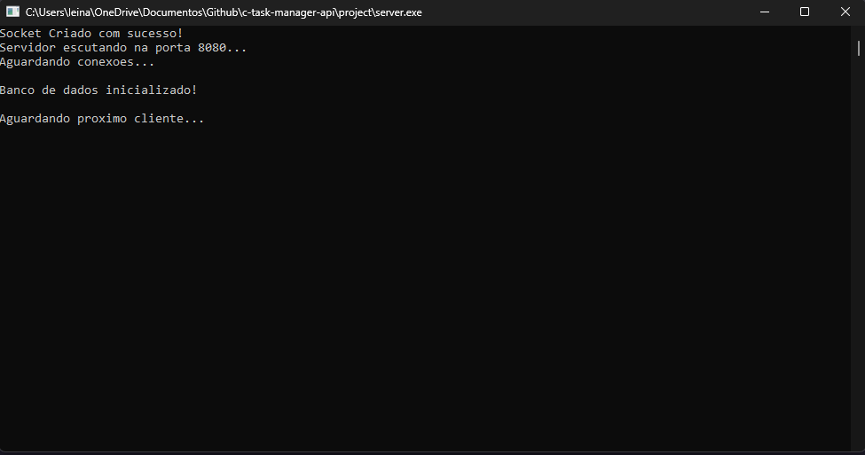
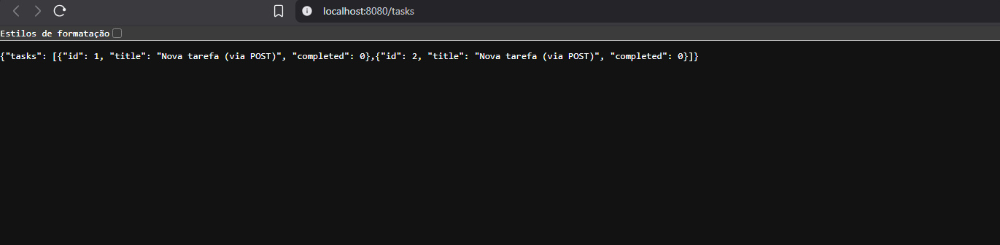
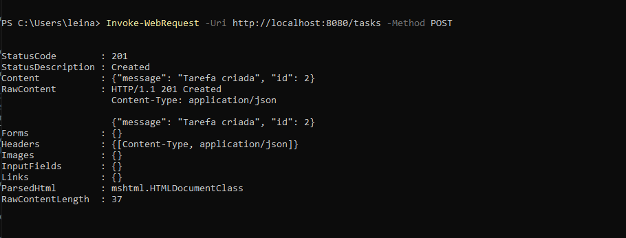

# 🗂️ C Task Manager API 
## 🇧🇷 Descrição

> API REST para gerenciamento de tarefas construída **do zero** em C puro, sem frameworks.

[](https://en.wikipedia.org/wiki/C_(programming_language))
[](https://www.microsoft.com/windows)
[](https://www.sqlite.org/)

---

## 📌 Sobre o Projeto

Este projeto implementa uma **API REST completa** em C, incluindo:
- ✅ Servidor HTTP construído manualmente com **Winsock** (sockets TCP/IP)
- ✅ Parser HTTP para processar requisições
- ✅ Sistema de roteamento para múltiplos endpoints
- ✅ Persistência de dados com **SQLite**
- ✅ Suporte completo a **CRUD** (Create, Read, Update, Delete)

**Objetivo:** Solidificar conhecimentos de programação de baixo nível, networking e arquitetura de APIs.

---

## 🛠️ Tecnologias Utilizadas

- **Linguagem:** C (C11)
- **Networking:** Winsock2 (Windows Sockets API)
- **Banco de Dados:** SQLite3
- **Protocolo:** HTTP/1.1
- **Formato de Dados:** JSON

---

## 📁 Estrutura do Projeto
```
c-task-manager-api/
├── project/
│   ├── main.c              # Inicialização e loop principal do servidor
│   ├── database.h          # Interface do módulo de banco de dados
│   ├── database.c          # Implementação das operações CRUD
│   ├── sqlite/
│   │   ├── sqlite3.h       # Header do SQLite
│   │   └── sqlite3.c       # Implementação do SQLite
│   └── tasks.db            # Banco de dados (criado automaticamente)
├── README.md
└── .gitignore
```

---

## 🚀 Como Rodar o Projeto

### **Pré-requisitos:**
- Windows 10/11
- GCC (MinGW ou MSYS2)
- Git (opcional)

### **Passo a Passo:**

1. **Clone o repositório:**
```bash
   git clone https://github.com/Daniel16Bit/c-task-manager-api.git
   cd c-task-manager-api/project
```

2. **Compile o projeto:**
```bash
   gcc main.c database.c sqlite/sqlite3.c -o server.exe -lws2_32
```

3. **Execute o servidor:**
```bash
   ./server.exe
```

4. **Acesse no navegador:**
```
   http://localhost:8080
```

---

## 📡 Endpoints da API

| Método | Endpoint | Descrição | Exemplo de Resposta |
|--------|----------|-----------|---------------------|
| `GET` | `/` | Página inicial com lista de rotas | HTML |
| `GET` | `/tasks` | Lista todas as tarefas | `{"tasks": [...]}` |
| `GET` | `/tasks/:id` | Busca tarefa por ID | `{"id": 1, "title": "...", "completed": 0}` |
| `POST` | `/tasks` | Cria nova tarefa | `{"message": "Tarefa criada", "id": 3}` |
| `PUT` | `/tasks/:id` | Atualiza tarefa existente | `{"message": "Tarefa 1 atualizada"}` |
| `DELETE` | `/tasks/:id` | Deleta tarefa | `{"message": "Tarefa 1 deletada"}` |

---

## 💻 Exemplos de Uso

### **Listar todas as tarefas:**
```bash
curl http://localhost:8080/tasks
```

**Resposta:**
```json
{
  "tasks": [
    {"id": 1, "title": "Estudar C", "completed": 0},
    {"id": 2, "title": "Fazer API", "completed": 1}
  ]
}
```

### **Criar nova tarefa:**
```powershell
Invoke-WebRequest -Uri http://localhost:8080/tasks -Method POST
```

### **Atualizar tarefa:**
```powershell
Invoke-WebRequest -Uri http://localhost:8080/tasks/1 -Method PUT
```

### **Deletar tarefa:**
```powershell
Invoke-WebRequest -Uri http://localhost:8080/tasks/1 -Method DELETE
```

---

## 🏗️ Arquitetura

### **Fluxo de Execução:**
```
Cliente (navegador/curl)
    ↓ (HTTP Request)
Servidor (main.c)
    ↓ (parse requisição)
Roteador (if/else)
    ↓ (identifica rota)
Database (database.c)
    ↓ (query SQLite)
SQLite (tasks.db)
    ↓ (retorna dados)
Servidor (formata JSON)
    ↓ (HTTP Response)
Cliente
```

### **Componentes:**

1. **Servidor TCP/IP:** Gerencia conexões via Winsock
2. **Parser HTTP:** Extrai método e caminho das requisições
3. **Roteador:** Mapeia URLs para funções específicas
4. **Módulo Database:** Abstrai operações SQLite
5. **Gerador JSON:** Monta respostas em formato JSON

---

## 🧠 Decisões Técnicas

### **Por que C em vez de Node.js/Python?**
- Entender networking em baixo nível
- Dominar gerenciamento manual de memória
- Aprender como servidores funcionam "por baixo dos panos"

### **Por que SQLite?**
- Banco de dados leve e embutido
- Não requer servidor separado
- Ideal para projetos acadêmicos/portfólio

### **Por que construir HTTP manualmente?**
- Frameworks abstraem demais o funcionamento real
- Aprendizado profundo do protocolo HTTP
- Diferencial em entrevistas técnicas

---

## 🐛 Limitações Conhecidas

- ⚠️ **Sem suporte a HTTPS** (apenas HTTP)
- ⚠️ **Sem autenticação** (endpoints públicos)
- ⚠️ **Sem parsing de JSON body** (POST/PUT usam dados fixos)
- ⚠️ **Single-threaded** (uma conexão por vez)
- ⚠️ **Apenas Windows** (usa Winsock)


## 📸 Screenshots

### **Servidor rodando:**


### **GET /tasks no navegador:**


### **POST via PowerShell:**


---

## 🎓 O Que Aprendi

- Programação de sockets TCP/IP (Winsock)
- Protocolo HTTP (requisições, respostas, status codes)
- Parsing de strings em C
- Gerenciamento de memória dinâmica (`malloc`, `free`)
- Integração C + SQLite (callbacks, prepared statements)
- Arquitetura REST
- Debugging de baixo nível

---

## 📄 Licença

Este projeto é de código aberto para fins educacionais.

---

## 👤 Autor

**Marcos Daniel**
- GitHub: [@Daniel16Bit](https://github.com/Daniel16Bit)
- LinkedIn: [Marcos Daniel](https://www.linkedin.com/in/marcos-daniel-245b94352/)
- Email: mdaniel.main@gmail.com

---

## 🙏 Agradecimentos

Projeto desenvolvido como parte dos meus estudos em Engenharia de Software, com foco em programação de sistemas e networking.


--------------------
# 🗂️ C Task Manager API

> RESTful API for task management built **from scratch** in pure C, without frameworks.

[](https://en.wikipedia.org/wiki/C_(programming_language))
[](https://www.microsoft.com/windows)
[](https://www.sqlite.org/)

---

## 📌 About the Project

This project implements a **complete REST API** in C, including:
- ✅ HTTP server built manually with **Winsock** (TCP/IP sockets)
- ✅ HTTP parser to process requests
- ✅ Routing system for multiple endpoints
- ✅ Data persistence with **SQLite**
- ✅ Full **CRUD** support (Create, Read, Update, Delete)

**Goal:** Solidify knowledge of low-level programming, networking, and API architecture.

---

## 🛠️ Technologies Used

- **Language:** C (C11)
- **Networking:** Winsock2 (Windows Sockets API)
- **Database:** SQLite3
- **Protocol:** HTTP/1.1
- **Data Format:** JSON

---

## 📁 Project Structure
## 🇺🇸 Description
```
c-task-manager-api/
├── project/
│   ├── main.c              # Server initialization and main loop
│   ├── database.h          # Database module interface
│   ├── database.c          # CRUD operations implementation
│   ├── sqlite/
│   │   ├── sqlite3.h       # SQLite header
│   │   └── sqlite3.c       # SQLite implementation
│   └── tasks.db            # Database (auto-created)
├── README.md
├── README_EN.md
└── .gitignore
```

---

## 🚀 How to Run the Project

### **Prerequisites:**
- Windows 10/11
- GCC (MinGW or MSYS2)
- Git (optional)

### **Step by Step:**

1. **Clone the repository:**
```bash
   git clone https://github.com/Daniel16Bit/c-task-manager-api
   cd c-task-manager-api/project
```

2. **Compile the project:**
```bash
   gcc main.c database.c sqlite/sqlite3.c -o server.exe -lws2_32
```

3. **Run the server:**
```bash
   ./server.exe
```

4. **Access in your browser:**
```
   http://localhost:8080
```

---

## 📡 API Endpoints

| Method | Endpoint | Description | Example Response |
|--------|----------|-------------|------------------|
| `GET` | `/` | Home page with route list | HTML |
| `GET` | `/tasks` | List all tasks | `{"tasks": [...]}` |
| `GET` | `/tasks/:id` | Get task by ID | `{"id": 1, "title": "...", "completed": 0}` |
| `POST` | `/tasks` | Create new task | `{"message": "Task created", "id": 3}` |
| `PUT` | `/tasks/:id` | Update existing task | `{"message": "Task 1 updated"}` |
| `DELETE` | `/tasks/:id` | Delete task | `{"message": "Task 1 deleted"}` |

---

## 💻 Usage Examples

### **List all tasks:**
```bash
curl http://localhost:8080/tasks
```

**Response:**
```json
{
  "tasks": [
    {"id": 1, "title": "Study C", "completed": 0},
    {"id": 2, "title": "Build API", "completed": 1}
  ]
}
```

### **Create new task:**
```powershell
Invoke-WebRequest -Uri http://localhost:8080/tasks -Method POST
```

### **Update task:**
```powershell
Invoke-WebRequest -Uri http://localhost:8080/tasks/1 -Method PUT
```

### **Delete task:**
```powershell
Invoke-WebRequest -Uri http://localhost:8080/tasks/1 -Method DELETE
```

---

## 🏗️ Architecture

### **Execution Flow:**
```
Client (browser/curl)
    ↓ (HTTP Request)
Server (main.c)
    ↓ (parse request)
Router (if/else)
    ↓ (identify route)
Database (database.c)
    ↓ (SQLite query)
SQLite (tasks.db)
    ↓ (return data)
Server (format JSON)
    ↓ (HTTP Response)
Client
```

### **Components:**

1. **TCP/IP Server:** Manages connections via Winsock
2. **HTTP Parser:** Extracts method and path from requests
3. **Router:** Maps URLs to specific functions
4. **Database Module:** Abstracts SQLite operations
5. **JSON Generator:** Builds responses in JSON format

---

## 🧠 Technical Decisions

### **Why C instead of Node.js/Python?**
- Understand low-level networking
- Master manual memory management
- Learn how servers work "under the hood"

### **Why SQLite?**
- Lightweight, embedded database
- No separate server required
- Ideal for academic/portfolio projects

### **Why build HTTP manually?**
- Frameworks abstract too much of the real functionality
- Deep learning of the HTTP protocol
- Competitive advantage in technical interviews

---

## 🐛 Known Limitations

- ⚠️ **No HTTPS support** (HTTP only)
- ⚠️ **No authentication** (public endpoints)
- ⚠️ **No JSON body parsing** (POST/PUT use fixed data)
- ⚠️ **Single-threaded** (one connection at a time)
- ⚠️ **Windows only** (uses Winsock)

---

## 📸 Screenshots

### **Server running:**


### **GET /tasks in browser:**


### **POST via PowerShell:**


---

## 🎓 What I Learned

- TCP/IP socket programming (Winsock)
- HTTP protocol (requests, responses, status codes)
- String parsing in C
- Dynamic memory management (`malloc`, `free`)
- C + SQLite integration (callbacks, prepared statements)
- REST architecture
- Low-level debugging

---

## 📄 License

This project is open source for educational purposes.

---

## 👤 Author

**Marcos Daniel**
- GitHub: [@Daniel16Bit](https://github.com/Daniel16Bit)
- LinkedIn: [Marcos Daniel](https://www.linkedin.com/in/marcos-daniel-245b94352/)
- Email: mdaniel.main@gmail.com

---

## 🙏 Acknowledgments

Project developed as part of my studies in Software Engineering, focusing on systems programming and networking.

---